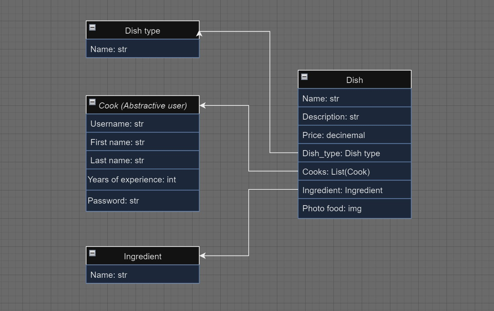

# Restaurant Kitchen Service

Restaurant Kitchen Service is a web application designed to manage the operations of a restaurant kitchen. It allows users to manage dishes, ingredients, and dish types, providing a seamless way to organize and streamline kitchen tasks.


View website: https://restaurant-kitchen-service-xm6y.onrender.com

Unfortunately, on the rendered site, you will not see the food photos because the free version of Render is being used, and it does not support images uploaded through the server by chefs or administrators. P.S. In the local version, all photos will be displayed correctly. The issue lies with the free version of Render.com.

## Features

- **Dish Management**: Create, update, and delete dishes.
- **Ingredient Management**: Track and manage ingredients for each dish.
- **Dish Type Management**: Categorize dishes by their type.
- **Search Functionality**: Easily search for dishes and ingredients.
- **User Authentication**: Secure login and registration for kitchen staff.

## Technologies Used

- **Backend**: Django
- **Frontend**: HTML, CSS, JavaScript
- **Database**: SQLite (can be configured to use PostgreSQL, MySQL, etc.)
- **Authentication**: Django's built-in authentication system
- **Styling**: Bootstrap

## Getting Started

### Prerequisites

Make sure you have the following installed on your system:

- Python 3.x
- pip
- virtualenv (optional but recommended)

### Installation

1. Clone the repository:

    ```sh
    git clone https://github.com/skeletronys/restaurant-kitchen-service.git
    cd restaurant-kitchen-service
    ```

2. Create and activate a virtual environment:

    ```sh
    python -m venv env
    source env/bin/activate  # On Windows use `env\Scripts\activate`
    ```

3. Install the required packages:

    ```sh
    pip install -r requirements.txt
    ```

4. Apply migrations:

    ```sh
    python manage.py migrate
    ```

5. Create a superuser:

    ```sh
    python manage.py createsuperuser
    ```

6. Add the following environment:

   Use `https://djecrety.ir` for generate Key

    ```sh
   set DEBUG_KEY=False
   set SECRET_KEY=Key
   set USE_POSTGRESQL=True
    ```

7. Run the development server:

    ```sh
    python manage.py runserver
    ```

8. Open your web browser and go to `http://127.0.0.1:8000`.

## Usage

### Running Tests

To run the tests for this project, use the following command:

```sh
python manage.py test
